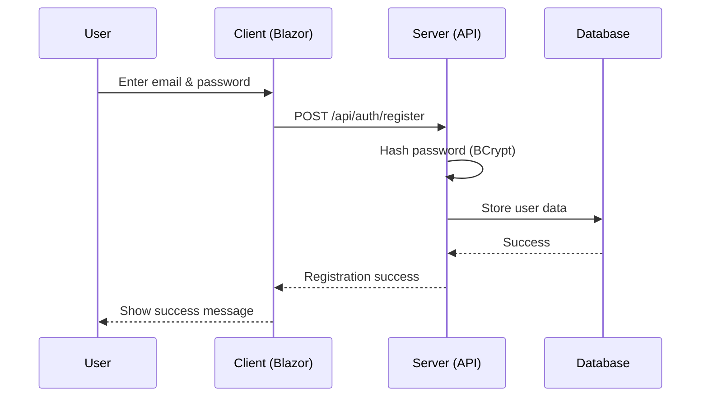
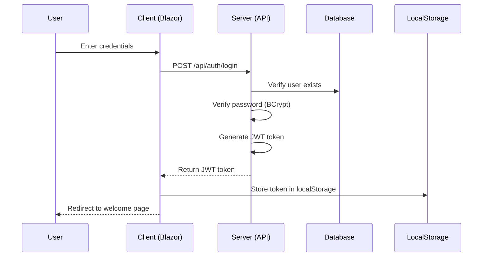
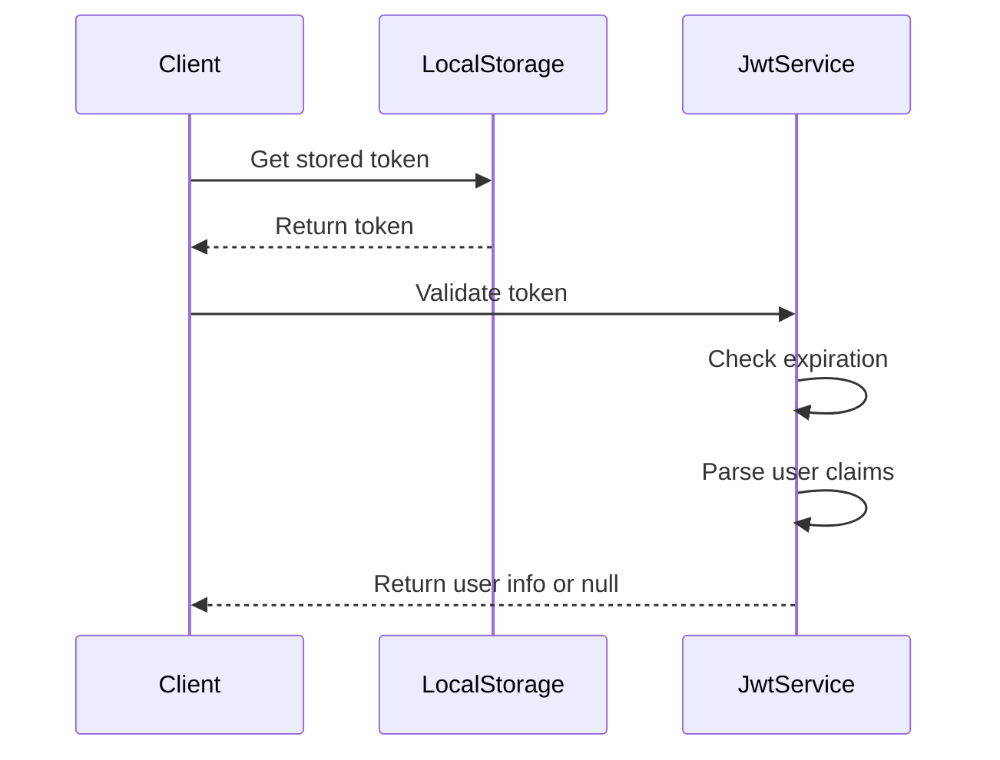

# Blazor WebAssembly Authentication System

A full-stack authentication system built with Blazor WebAssembly, ASP.NET Core Web API, and JWT tokens. This project demonstrates modern web development practices with client-side rendering, secure authentication, and responsive UI design.

## 🏗️ Architecture Overview

This project follows a **three-tier architecture** pattern:

```
┌─────────────────┐    ┌─────────────────┐    ┌─────────────────┐
│   Client        │    │   Server        │    │   Database      │
│  (Blazor WASM)  │    │ (ASP.NET Core)  │    │   (SQLite)      │
│                 │    │                 │    │                 │
│ • Razor Pages   │◄──►│ • JWT Auth      │◄──►│ • User Storage  │
│ • JWT Handling  │    │ • BCrypt Hash   │    │ • EF Core       │
│ • Local Storage │    │ • Entity FW     │    │                 │
└─────────────────┘    └─────────────────┘    └─────────────────┘
```

### Project Structure

```
MyAuthApp/
├── Client/                 # Blazor WebAssembly Frontend
│   ├── Pages/             # Razor components (Login, Register, etc.)
│   ├── Services/          # JWT token handling
│   ├── Layout/            # UI layout components
│   └── wwwroot/           # Static assets
├── Server/                # ASP.NET Core Web API Backend
│   ├── Controllers/       # Authentication API endpoints
│   ├── Models/           # Data models
│   ├── Data/             # Entity Framework context
│   └── Migrations/       # Database migrations
└── Shared/               # Common DTOs and models
    └── UserDto.cs        # Data transfer objects
```

## 🔐 Authentication Flow

### 1. Registration Process


### 2. Login Process


### 3. Token Validation


## 🛠️ Technology Stack

### Frontend (Client)
- **Blazor WebAssembly** - Client-side C# framework
- **HTML5/CSS3** - Modern responsive design
- **JavaScript Interop** - LocalStorage integration
- **.NET 9.0** - Latest .NET framework

### Backend (Server)
- **ASP.NET Core Web API** - RESTful API endpoints
- **Entity Framework Core** - ORM for database operations
- **JWT Bearer Authentication** - Stateless token-based auth
- **BCrypt.Net** - Secure password hashing
- **SQLite** - Lightweight database

### Security Features
- **JWT Tokens** - Secure, stateless authentication
- **Password Hashing** - BCrypt with salt
- **CORS Configuration** - Cross-origin resource sharing
- **Token Expiration** - 1-hour token lifetime
- **Client-side Validation** - Input validation and error handling

## 🚀 Getting Started

### Prerequisites
- [.NET 9.0 SDK](https://dotnet.microsoft.com/download)
- [Visual Studio 2022](https://visualstudio.microsoft.com/) or [VS Code](https://code.visualstudio.com/)

### Installation & Setup

1. **Clone the repository**
   ```bash
   git clone https://github.com/yourusername/Blazor-WebAssembly-Authentication-System.git
   cd Blazor-WebAssembly-Authentication-System
   ```

2. **Restore NuGet packages**
   ```bash
   dotnet restore
   ```

3. **Setup the database**
   ```bash
   cd Server
   dotnet ef database update
   ```

4. **Run the application**
   ```bash
   # From the solution root
   dotnet run --project Server
   ```

5. **Access the application**
   - Open your browser and navigate to `https://localhost:5001` or `http://localhost:5000`

### Database Migration (if needed)
```bash
cd Server
dotnet ef migrations add InitialCreate
dotnet ef database update
```

## 📱 Features

### User Authentication
- ✅ **User Registration** - Create new accounts with email validation
- ✅ **User Login** - Secure authentication with JWT tokens
- ✅ **Password Security** - BCrypt hashing with salt
- ✅ **Token Management** - Automatic token storage and validation
- ✅ **Session Persistence** - Remember login state across browser sessions

### User Interface
- ✅ **Responsive Design** - Mobile-friendly responsive layout
- ✅ **Modern UI** - Clean, professional interface with animations
- ✅ **Form Validation** - Real-time input validation and error messages
- ✅ **Loading States** - Visual feedback during API calls
- ✅ **Navigation** - Seamless routing between pages

### Security
- ✅ **JWT Authentication** - Industry-standard token-based security
- ✅ **Secure Password Storage** - Never store plain text passwords
- ✅ **Token Expiration** - Automatic token refresh and logout
- ✅ **CORS Protection** - Secure cross-origin requests

## 📊 API Endpoints

### Authentication Controller (`/api/auth`)

| Method | Endpoint | Description | Request Body | Response |
|--------|----------|-------------|--------------|----------|
| POST | `/register` | Register new user | `{ email, password }` | Success message |
| POST | `/login` | Authenticate user | `{ email, password }` | JWT token |

### Example API Usage

**Register a new user:**
```bash
curl -X POST https://localhost:5001/api/auth/register \
  -H "Content-Type: application/json" \
  -d '{"email":"user@example.com","password":"SecurePass123"}'
```

**Login:**
```bash
curl -X POST https://localhost:5001/api/auth/login \
  -H "Content-Type: application/json" \
  -d '{"email":"user@example.com","password":"SecurePass123"}'
```

## 🗄️ Database Schema

### Users Table
```sql
CREATE TABLE Users (
    Id TEXT PRIMARY KEY,
    Name TEXT NOT NULL DEFAULT '',
    Email TEXT NOT NULL UNIQUE,
    PasswordHash TEXT NOT NULL
);
```

## 🔧 Configuration

### JWT Configuration (Server/Program.cs)
```csharp
builder.Services.AddAuthentication(JwtBearerDefaults.AuthenticationScheme)
    .AddJwtBearer(options => {
        options.TokenValidationParameters = new TokenValidationParameters {
            ValidateIssuer = false,
            ValidateAudience = false,
            ValidateLifetime = true,
            ValidateIssuerSigningKey = true,
            IssuerSigningKey = new SymmetricSecurityKey(/* secret key */)
        };
    });
```

### Database Configuration
```csharp
builder.Services.AddDbContext<AppDbContext>(options =>
    options.UseSqlite("Data Source=users.db"));
```

## 🎨 UI Components

### Pages
- **Home.razor** - Landing page with navigation
- **Login.razor** - User authentication form
- **Register.razor** - New user registration form
- **Welcome.razor** - Protected dashboard after login

### Key Features of UI
- **Gradient backgrounds** with modern color schemes
- **Form validation** with real-time feedback
- **Loading animations** during API calls
- **Responsive design** for mobile and desktop
- **Font Awesome icons** for enhanced UX

## 🔒 Security Considerations

### Implemented Security Measures
1. **Password Hashing** - BCrypt with automatic salt generation
2. **JWT Tokens** - Signed tokens with expiration
3. **HTTPS Enforcement** - Secure transport in production
4. **Input Validation** - Client and server-side validation

### Security Best Practices Applied
- Never store passwords in plain text
- Use secure random token generation
- Implement proper token expiration
- Validate all user inputs
- Use parameterized queries (EF Core)